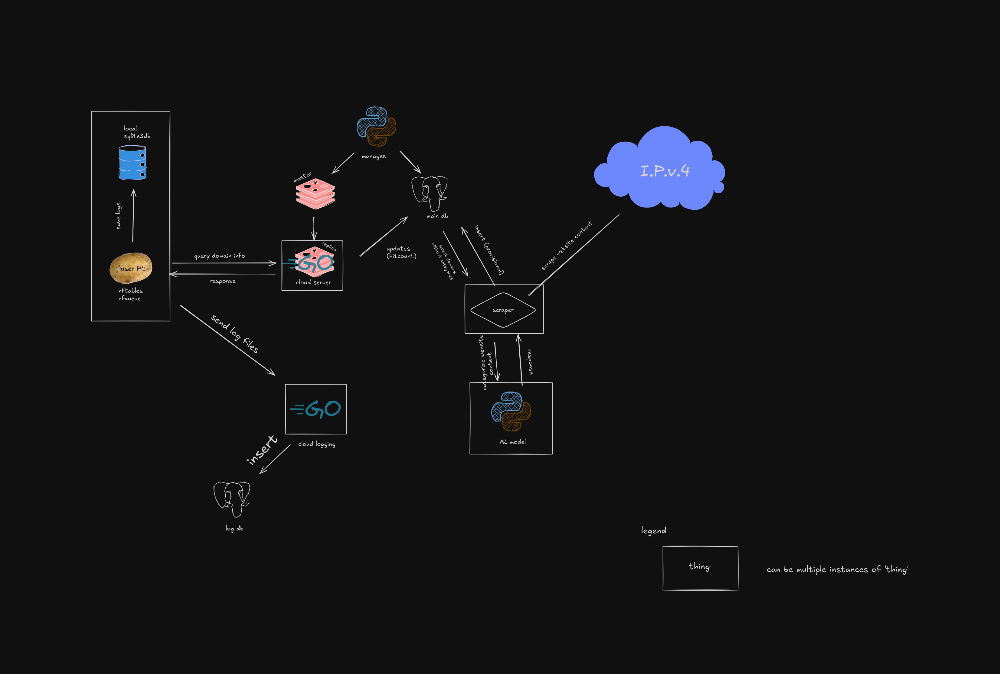

# uwebfilter

a small webfilter project

### features
 - filters DNS and HTTP/HTTPS traffic (with tcp flow recontruction)
 - saves detailed logs about filtered traffic
 - scrapes websites & categorizes them using machine learning

intended for personal use, but can easily be made production-ready

  architecture
----------------

  services
------------
| service               | role                                         |
| --------------------- | -------------------------------------------- |
| uwebfilter.d          | packet processing daemon                     |
| uwebfilter.server     | web server for uwebfilter.d to query         |
| uwebfilter.logcollect | cloud server to collect logs                 |
| uwebfilter.database   | postgres & redis                             |
| uwebfilter.scraper    | scrape websites and update db                |
| uwebfilter.categorify | ml model to categorize contents of a website |

  todo
--------
 - [ ] category & application based rate limiting
 - [ ] web interface to easily manage uwebfilterd's config
 - [ ] web interface to easily manage databases
 - [ ] proxy servers for scraping websites
